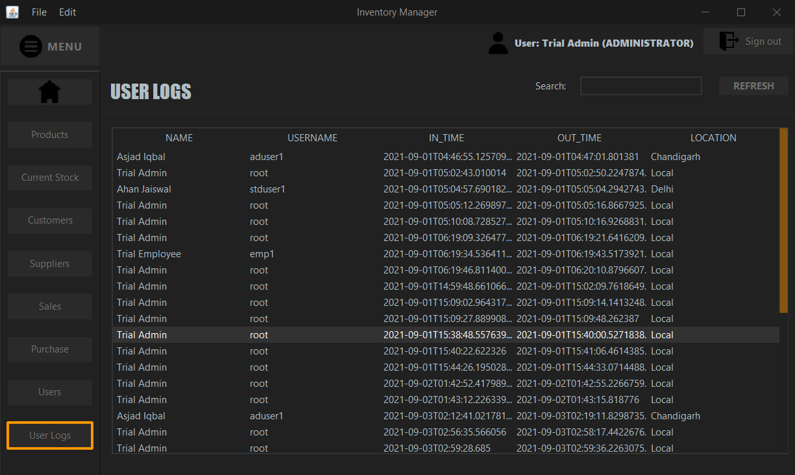

# Sistema de Gestão de Inventário

Este é um Sistema de Gestão de Inventário desenvolvido como uma aplicação de desktop com interface gráfica (GUI) em ***Java***, utilizando ***MySQL*** como banco de dados.  
A interface gráfica foi projetada usando **Swing** e a conectividade com o banco de dados foi gerida utilizando **JDBC API**.

Esta aplicação pode ser usada por pequenas e médias lojas para gerenciar facilmente um inventário de todos os seus:
- Produtos
- Clientes
- Fornecedores
- Usuários
- Transações

## Funcionalidades da Aplicação

- Os usuários podem gerenciar o inventário e o estoque de todos os produtos disponíveis na loja.
- Os usuários podem gerenciar todas as transações de vendas e compras realizadas pela loja.
- Suporta dois tipos de usuários:
  1. Administrador
  2. Funcionário
  
  [Os administradores têm a capacidade de gerenciar todos os outros funcionários.]
- Qualquer transação realizada ajusta automaticamente a disponibilidade de estoque no inventário.
- Cada seção inclui uma funcionalidade de busca para facilitar a visualização dos dados desejados pelos usuários.
- Os usuários só precisam inserir o código do produto ao realizar uma venda, e todos os detalhes relevantes serão recuperados automaticamente do banco de dados.
- Mantém um registro de tempo de todos os usuários que utilizam a aplicação.

## Como baixar e executar o software

#### Requisitos mínimos: JDK ou JRE versão 16.

1. Baixe e descompacte a pasta ZIP: [InventoryManagement.zip](InventoryManagement.zip)
2. Baixe o [arquivo SQL dump](SQL/InventoryDB.sql)
3. Importe o arquivo SQL dump usando o MySQL Workbench para criar localmente o esquema e as tabelas associadas a este software.
4. Após a criação local do esquema de inventário, você pode executar o arquivo JAR (InventoryManagement.jar) incluído na pasta zipada.
5. As credenciais padrão para a conexão com o banco de dados MySQL são:
    - Nome de usuário: root
    - Senha: root
  
    Caso seu banco de dados utilize um nome de usuário e senha diferentes para conexão, siga estes passos:
    1. Vá para a pasta `lib` no arquivo zipado que você baixou.
    2. Abra o arquivo fonte XML `DBCredentials.xml`.
    3. Simplesmente altere os valores das duas tags `entry` com os valores `username` e `password` de "root" para o nome de usuário e senha que você está usando. (Linhas 12 e 13)
        ```xml
          <properties>
          <comment>Credenciais para o banco de dados.</comment>
            <entry key="username">root</entry>
            <entry key="password">root</entry>
          </properties>
        ```
6. Quando essas credenciais coincidirem, o arquivo JAR deve ser executado sem problemas, desde que você tenha o JRE mínimo.
7. Você pode fazer login na aplicação usando Nome de Usuário: `root` e Senha: `root`.

### Nota:

Todas as dependências do projeto estão disponíveis no diretório [`lib`](lib/).

***

## Visualização da Aplicação

### Página de Login

A página de login recebe as credenciais inseridas pelo usuário e verifica com o banco de dados.


### Painel de Controle/Página de Boas-vindas

A página inicial da aplicação após um login bem-sucedido.


### Produtos

A seção de produtos permite que o usuário adicione, edite e exclua produtos do inventário da loja.


### Estoque Atual

Esta seção permite que o usuário verifique a disponibilidade de cada item.


### Fornecedores

Aqui, o usuário pode gerenciar e manipular o registro de todos os fornecedores associados à loja.


### Clientes

Permite que o usuário adicione novos clientes ou atualize/exclua clientes existentes no banco de dados.


### Vendas

Esta seção é onde os usuários podem vender um produto e gerenciar todas as transações de vendas.  
O usuário só precisa inserir o código do cliente e do produto, e o software cuidará do resto, mostrando todos os detalhes necessários, como estoque disponível e preço de venda do produto.


### Compras

Esta seção é onde os usuários podem visualizar registros de compras e inserir novas transações de compras.  
Semelhante à seção de vendas, esta seção só requer que o usuário insira o código do produto e os detalhes que já estão disponíveis no banco de dados serão imediatamente exibidos nos respectivos campos.


### Usuários

Esta seção está disponível apenas para **ADMINISTRADORES**. Ela permite que eles visualizem, adicionem e excluam qualquer usuário.


### Logs de Usuários

Armazena e mostra ao administrador um registro de todos os usuários que fizeram login anteriormente, incluindo seus horários de login e logout.



***

## Tecnologias Utilizadas

As seguintes tecnologias foram utilizadas no desenvolvimento deste projeto. Todas são de uso gratuito.
  - JetBrains IntelliJ IDE
  - Apache NetBeans IDE (para o design da GUI)
  - MySQL Server e Workbench
  - JDK 16

## Diagrama ER

O diagrama ER para o esquema de exemplo que foi utilizado na aplicação.


## Código-Fonte

O código do software foi dividido em quatro pacotes diferentes:
  - Data Access Object (DAO): Contém a camada de acesso a dados do software, que interage diretamente com o banco de dados e suas tabelas. Utilizado para recuperação e modificação de dados.
  - Data Transfer Object (DTO): Contém a camada de transferência de dados que permite a transferência de dados entre a camada de acesso a dados e a camada de interface de usuário.
  - Database: Contém a classe ConnectionFactory que recupera a conexão com o banco de dados e verifica as credenciais do usuário para a aplicação.
  - User Interface (UI): Contém todas as classes GUI que compõem a camada de interface do software.

Clique [aqui](src/com/inventory/) para ir diretamente ao código-fonte.

## Trabalho em Progresso

Este projeto está em andamento e mais funcionalidades ainda serão adicionadas com novas tecnologias.
